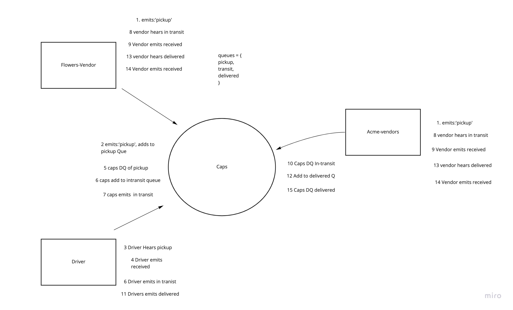

# LAB - Class 13

# queue-server

## Project: Code Academy Parcel Service (CAPS)

> CAPS Phase 3: Complete work on a multi-day build of our delivery tracking system, adding queued delivery
In this phase, we’ll be adding a layer of complexity to our application. Rather than just “fire” events and hope that our vendors and drivers respond to them, we’re going to implement a “queue” system so that nothing gets lost. Every event sent will be logged and held onto by the server until the intended recipient acknowledges that they received the message. At any time, a subscriber can get all of the messages they might have missed. In this final phase, we’ll be building out the queue itself, getting our vendors subscribed to it, and focusing on just one event - delivered to set the pattern for subscribing to, and working with queues.

### Authors:
- Arthur Lozano

### Links and Resources

- [back-end server url](http://localhost:3000)
- PR ()

### Setup

#### `.env` requirements (where applicable)

- `PORT` - 3000

#### How to initialize/run your application 

- `npm start`

#### UML

